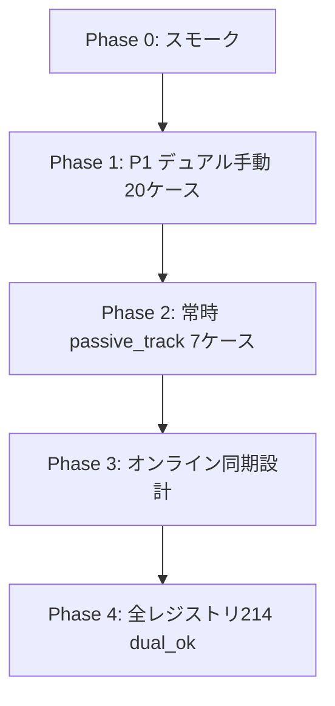

# 対戦モード実装計画

対戦モード（localDual / オンライン）を本格化するときの作業計画。  
相手盤面効果の全件台帳は [opponent-board-effects-registry.md](./opponent-board-effects-registry.md) を参照。

- レジストリ再生成: `node scripts/audit-opponent-board-effects.mjs`
- デュアル高リスク監査: `node scripts/audit-dual-mode-gaps.mjs`
- デュアルスモーク（代表16枚）: `node scripts/verify-dual-mode-smoke.mjs`

---

## 1. 現状サマリ（2026-06-28）

| レイヤ | 状態 |
|--------|------|
| **ソロ** | 相手代行ダイアログで215枚分の相手参照が概ね動作 |
| **localDual** | 共有ヘルパー（`runOnTargetPlayerBoard` 等）で214能力が `dual_ok` 判定 |
| **常時（passive_track）** | 50能力。相手成功ライブ枚数・相手ライブ必要ハート等を**常時追跡**する必要 |
| **オンライン** | 公開情報のみ同期。ライブスコア加点・常時効果は未同期の可能性大 |

`dualStatus: dual_gap` はレジストリ監査上 **0件**（2026-06-28 修正。以前の3件は `preconditionFilters` 未参照による誤検知だった）。

---

## 2. 旧 dual_gap 3件 — 詳細と対応方針

いずれも template `yell_resolution_pick_hand`。相手条件は **`preconditionFilters`** に入り、本体ハンドラは `checkYellRevealedPreconditionFilters` → `checkAbilityBoardPickFilters` に委譲。**デュアル盤では shared helper 経由で相手盤を読む実装済み**。ソロのライブスコア参照バグは 2026-06-23 に修正済み（[play-verification-list.md](./play-verification-list.md) B節）。

### 2.1 PL!HS-cl1-012-CL — Edelied

| 項目 | 内容 |
|------|------|
| 能力文 | 自分と相手のライブ合計スコアが**同点**の場合、エール公開からコスト9+メンバー1枚手札 |
| 分類 | `preconditionFilters.requiresLiveScoreTieWithOpponent` |
| ソロ | 発動前に「相手ライブ合計スコア」入力ダイアログ（`ensureSoloOpponentLiveFrameScore`） |
| デュアル | `opponentLiveScoreEstimate()` → 非アクティブ盤の `computeLiveFrameScoreParts()` |
| オンライン | 公開ライブの**印刷スコア合計のみ**。加点・常時ボーナスは未反映の可能性 |

**やること（優先度）**

1. **P1 デュアル手動確認**: 両盤でライブフレームスコアを同点にし、エール回収が発動すること
2. **P2 オンライン**: 相手ライブフレームスコア（加点込み）の同期設計
3. **P3 回帰**: `verify-dual-mode-smoke.mjs` に既登録（`requiresLiveScoreTieWithOpponent`）。デュアル実プレイ1回で十分

**コード触るなら**: `yell_resolution_pick_hand` 本体ではなく `opponentLiveScoreEstimate()` のオンライン分岐（`versusBoardSync` 側）

---

### 2.2 PL!N-bp1-026-L — Poppin' Up!

| 項目 | 内容 |
|------|------|
| 能力文 | ライブ合計スコアが相手**より高い**場合、エール公開から『虹ヶ咲』1枚手札 |
| 分類 | `preconditionFilters.requiresLiveScoreHigherThanOpponent` |
| ソロ / デュアル / オンライン | 2.1 と同型（条件が「より高い」のみ異なる） |

**やること**

1. **P1 デュアル手動確認**: 自スコア > 相手スコア → 虹ヶ咲回収。同点・逆転で不発
2. **P2 オンライン**: 2.1 と同じスコア同期課題
3. **P3 回帰**: スモーク登録済み（`PL!N-bp1-026-L` / `requiresLiveScoreHigherThanOpponent`）

---

### 2.3 PL!S-bp5-019-L — not ALONE not HITORI

| 項目 | 内容 |
|------|------|
| 能力文 | **自分か相手**の成功ライブ置き場が2枚以上 → エール公開からメンバー2枚まで手札 |
| 分類 | `preconditionFilters.minEitherSuccessLiveCount: 2` |
| ソロ | 自成功ライブ < 2 かつ相手枚数未入力なら `ensureSoloOpponentSuccessLiveCount` ダイアログ |
| デュアル | `countOpponentSuccessLiveCards()` → `readInactiveOpponentBoard` |
| オンライン | `versusOpponentSuccessLiveCount` または公開 `successfulLiveArea` |

**やること**

1. **P1 デュアル手動確認**: 相手成功ライブのみ2枚でも発動。自2枚以上ならダイアログ不要
2. **P2 オンライン**: 成功ライブ枚数のリアルタイム同期
3. **P3 回帰**: スモーク登録済み（`min_either_success_live`）

---

### 2.4 横展開メモ（yell_resolution_pick_hand 全般）

同 template で相手参照があるカードは他にも存在する。上記3件を直す／確認すれば **template 単位で横展開**できる。

| 共通処理 | ファイル目安 |
|----------|-------------|
| 前提判定 | `checkAbilityBoardPickFilters`（`simulator.js`） |
| ソロ入力 | `ensureSoloOpponentLiveFrameScore` / `ensureSoloOpponentSuccessLiveCount` |
| デュアル読取 | `opponentLiveScoreEstimate` / `countOpponentSuccessLiveCards` |
| オンライン | `getVersusOpponentPublicBoardNow` + 同期フィールド拡張 |

---

## 3. bp2 / bp3 対戦テスト計画

検証済み6セットのうち、**相手盤面に関わる代表20ケース**（レア違いは代表ID1つのみ）。  
Hasunosora bp2 は該当なし。

### 凡例

| 列 | 意味 |
|----|------|
| **P** | 優先度（1=必須, 2=常時系, 3=余力） |
| **ソロ** | 相手代行入力で確認する要点 |
| **デュアル** | 2盤面で確認する要点 |
| **オンライン** | H=要同期設計, L=公開情報で足りる可能性, —=対象外 |

---

### 3.1 Liella bp2（PL!SP-bp2）— 6ケース

| P | 代表ID | 名前 | タイミング | template | 相手との関わり | ソロ確認 | デュアル確認 | オンライン |
|---|--------|------|------------|----------|----------------|----------|--------------|------------|
| 2 | PL!SP-bp2-010-P | ウィーン | 常時 | passive_track | 相手ライブ置き場の必要ハート+1 | 相手ライブ置き場にライブ→必要ハート増 | 非アクティブ盤ライブの必要ハートが増える | H |
| 1 | PL!SP-bp2-011-P | 鬼塚冬毬 | 登場 | toujou_wait_pick_opp_live | 相手がライブ1枚選択 | 異名ライブ2枚提示→「ソロ:相手として」1枚選択→手札 | **非アクティブ側**が2枚から1枚選択 | H |
| 1 | PL!SP-bp2-023-L | Go!! リスタート | ライブ開始 | live_card_score_plus | 自成功ライブ < 相手成功ライブ | 相手成功ライブ枚数入力→+1 | 相手成功ライブ2枚・自0枚→+1 | L |
| 1 | PL!SP-bp2-024-L | ビタミンSUMMER！ | ライブ成功 | live_card_score_plus | 自手札 > 相手手札 | 相手手札枚数入力→+1 | 相手手札3・自4→+1 | L |

※ 025 Bubble Rise はエール回収のみで相手参照なし → 本計画対象外

---

### 3.2 Aqours bp2（PL!S-bp2）— 1ケース

| P | 代表ID | 名前 | タイミング | template | 相手との関わり | ソロ確認 | デュアル確認 | オンライン |
|---|--------|------|------------|----------|----------------|----------|--------------|------------|
| 2 | PL!S-bp2-001-P | 高海千歌 | 常時 | passive_track | 自成功0 & 相手成功1+ → ブレード3 | 相手成功ライブ1枚入力→ブレード3 | 相手成功ライブ1枚のみ→ブレード3付与 | H |

---

### 3.3 Hasunosora bp2（PL!HS-bp2）

相手盤面効果 **0件**。対戦テスト追加不要。

---

### 3.4 Nijigasaki bp3（PL!N-bp3）— 5ケース

| P | 代表ID | 名前 | タイミング | template | 相手との関わり | ソロ確認 | デュアル確認 | オンライン |
|---|--------|------|------------|----------|----------------|----------|--------------|------------|
| 1 | PL!N-bp3-010-P | 三船栞子 | ライブ開始 | live_start_pick_player_waiting_deck_bottom | **自分か相手**の控え室→山札下 | 「自分/相手」選択→控え室1枚山札下 | 非アクティブ盤の控え室から選べる | H |
| 1 | PL!N-bp3-011-P | ミア・テイラー | 登場 | toujou_opp_stage_member_match_grant | 相手ステージの同名メンバーに付与 | 相手ステージ同名→heart付与 | 非アクティブ盤ステージを直接変更 | H |
| 1 | PL!N-bp3-017-N | 宮下愛 | 登場 / LS | optional_self_wait_opp_stage | 自ウェイト任意→相手コスト4以下ウェイト | 自ウェイト→相手メンバー選択 | 非アクティブ盤でウェイト化 | H |
| 1 | PL!N-bp3-023-N | ミア・テイラー | 登場 / LS | optional_self_wait_opp_stage | 同上 | 同上 | 同上 | H |

---

### 3.5 Aqours bp3（PL!S-bp3）— 6ケース

| P | 代表ID | 名前 | タイミング | template | 相手との関わり | ソロ確認 | デュアル確認 | オンライン |
|---|--------|------|------------|----------|----------------|----------|--------------|------------|
| 1 | PL!S-bp3-002-P | 桜内梨子 | ライブ成功 | yell_resolution_pick_self_score | 自ライブスコア > 相手 | 相手スコア入力→エール回収 | 相手スコアより高い→回収 | H |
| 1 | PL!S-bp3-005-P | 渡辺曜 | ライブ成功 | draw_from_deck | 条件に相手参照（手札等） | 条件成立で1ドロー | デュアル盤で条件自動判定 | L |
| 1 | PL!S-bp3-007-P | 国木田花丸 | 起動 | draw_from_deck | 相手山札からも引く効果 | 相手ドロー枚数入力 | 非アクティブ盤の山札が減る | H |
| 1 | PL!S-bp3-012-N | 松浦果南 | 登場 / LS | optional_self_wait_opp_stage | 相手ステージウェイト | 自ウェイト任意→相手ウェイト | 非アクティブ盤操作 | H |
| 1 | PL!S-bp3-017-N | 小原鞠莉 | 登場 / LS | optional_self_wait_opp_stage | 同上 | 同上 | 同上 | H |
| 1 | PL!S-bp3-024-L | Deep Resonance | ライブ開始 | ability_pick_one | 選択肢に相手ステージ操作 | 選択肢から相手ウェイト等 | 非アクティブ側の選択UI | H |

---

### 3.6 µ's bp3（PL!-bp3）— 4ケース

| P | 代表ID | 名前 | タイミング | template | 相手との関わり | ソロ確認 | デュアル確認 | オンライン |
|---|--------|------|------------|----------|----------------|----------|--------------|------------|
| 1 | PL!-bp3-002-P | 絢瀬絵里 | 登場 | optional_self_wait_opp_stage | 相手コスト4以下2人ウェイト | 手札捨て任意→相手2人ウェイト | 非アクティブ盤で2人まで | H |
| 2 | PL!-bp3-002-P | 絢瀬絵里 | 常時 | passive_track | 相手ウェイト1人につき効果 | 相手ウェイト人数反映 | 非アクティブ盤ウェイト数 | H |
| 1 | PL!-bp3-022-L | ユメノトビラ | ライブ開始 | live_start_deck_reveal_both_stage_members_score | 両ステージ人数分公開→スコア+ | 相手ステージ人数入力 | 相手ステージメンバー数を自動カウント | H |
| 1 | PL!-bp3-026-L | Oh,Love&Peace! | ライブ成功 | live_card_score_plus | 自ハート総数 > 相手 | 相手ハート総数入力→+1 | 非アクティブ盤ハート合計と比較 | H |

---

### 3.7 Nijigasaki bp4（PL!N-bp4 / SAPPHIREMOON）— 8ケース

| P | 代表ID | 名前 | タイミング | template | 相手との関わり | ソロ確認 | デュアル確認 | オンライン |
|---|--------|------|------------|----------|----------------|----------|--------------|------------|
| 1 | PL!N-bp4-001-P | 上原歩夢 | ライブ成功 | energy_less_than_opponent_wait | 自E < 相手E | 相手E枚数入力→EDK1枚 | 非アクティブ盤E枚数と比較 | L |
| 1 | PL!N-bp4-002-P | 中須かすみ | ライブ開始 | live_start_pick_player_deck_top_peek | **自分か相手**の山札上 | プレイヤー選択→見て控え optional | 非アクティブ盤山札上 | H |
| 1 | PL!N-bp4-003-P | 桜坂しずく | ライブ成功 | draw_from_deck | ライブスコア > 相手 | 相手スコア入力→1ドロー | スコア自動比較 | H |
| 1 | PL!N-bp4-004-P | 朝香果林 | ライブ開始 | live_start_draw_opp_wait + waiting_to_deck_top_by_opp_wait_count | 相手ウェイト＋人数参照 | 相手1人ウェイト→人数分メンバー山札上 | 非アクティブ盤操作 | H |
| 1 | PL!N-bp4-005-P | 宮下愛 | 登場 | optional_self_wait_opp_stage | 相手コスト4以下2人ウェイト | 自ウェイト任意→相手2人 | 非アクティブ盤ウェイト | H |
| 1 | PL!N-bp4-007-P | 優木せつ菜 | 登場/常時/成功 | both系3能力 | **両者**ライブ回収・E合計15+・両者EDK | 各ダイアログ/両盤 | 非アクティブ盤を直接変更 | H |
| 1 | PL!N-bp4-009-P | 天王寺璃奈 | ライブ開始 | draw_from_deck | 自コスト合計 < 相手 | 相手コスト合計入力 | 自動比較 | L |
| 2 | PL!N-bp4-012-P | 鐘嵐珠 | 常時 | passive_track | 相手成功ライブスコア6+ | 相手成功ライブ合計入力 | 非アクティブ成功ライブ合計 | H |

---

## 4. 推奨テスト順（フェーズ）

| Phase | 内容 | 完了条件 |
|-------|------|----------|
| **0** | `verify-dual-mode-smoke.mjs` + セット別 `verify-*-bp*.mjs` | CI 緑 |
| **1** | 上表 P1 のデュアル盤手動（20ケース） | チェックリスト `[x]` |
| **2** | P2 常時効果（010ウィーン、001千歌、002絵里常時等） | 両盤で常時が追従 |
| **3** | オンライン: スコア・成功ライブ・手札枚数・ステージ変更の同期 | 公開/非公開の設計ドキュメント |
| **4** | [opponent-board-effects-registry.json](./opponent-board-effects-registry.json) の `dual_ok` 214件を template 単位でサンプリング | template 代表テスト追加 |

---

## 5. 実装タスク分解（対戦本格化時）

| # | タスク | 触るファイル目安 | 依存 |
|---|--------|-------------------|------|
| 1 | デュアル P1 手動20件の結果を本ドキュメントに `[x]` 記録 | 本ファイル | — |
| 2 | `verify-dual-mode-smoke.mjs` に bp2/bp3 代表を追加（011冬毬、010栞子、022ユメノトビラ等） | `scripts/verify-dual-mode-smoke.mjs` | Phase 1 |
| 3 | 常時効果の非アクティブ盤同期（`syncJoujiPassiveEffectsAll`） | `simulator.js`, `joujiEffects.js` | Phase 2 |
| 4 | オンライン: ライブフレームスコア（加点込み）同期 | `versusBoardSync.js`, `versusMatch.js` | Phase 3 |
| 5 | オンライン: 相手選択 UI（011冬毬等）のリモート意思決定 | `versusMode.js` | Phase 3 |
| 6 | レジストリを CI に組込（生成 + 件数下限） | `verify-ability-coverage.mjs` | 任意 |

---

## 6. チェックリスト（Phase 1 手動）

実施したら `[ ]` → `[x]` に変更。

### Liella bp2
- [ ] PL!SP-bp2-011-P デュアル: 相手選択
- [ ] PL!SP-bp2-023-L デュアル: 成功ライブ枚数比較
- [ ] PL!SP-bp2-024-L デュアル: 手札枚数比較

### Aqours bp2
- [ ] PL!S-bp2-001-P デュアル: 常時ブレード3

### Niji bp3
- [ ] PL!N-bp3-010-P デュアル: 自分/相手の控え室
- [ ] PL!N-bp3-011-P デュアル: 相手ステージ同名付与
- [ ] PL!N-bp3-017-N デュアル: optional_self_wait_opp_stage

### Aqours bp3
- [ ] PL!S-bp3-002-P デュアル: ライブスコア比較
- [ ] PL!S-bp3-007-P デュアル: 相手山札から引く
- [ ] PL!S-bp3-024-L デュアル: ability_pick_one 相手枝

### µ's bp3
- [ ] PL!-bp3-002-P デュアル: 相手2人ウェイト
- [ ] PL!-bp3-022-L デュアル: 両ステージ人数公開
- [ ] PL!-bp3-026-L デュアル: ハート総数比較

### 旧 dual_gap（横展開確認）
- [ ] PL!HS-cl1-012-CL デュアル: ライブスコア同点
- [ ] PL!N-bp1-026-L デュアル: ライブスコアより高い
- [ ] PL!S-bp5-019-L デュアル: どちらか成功ライブ2+

### Niji bp4（SAPPHIREMOON）
- [ ] PL!N-bp4-001-P デュアル: エネルギー枚数比較
- [ ] PL!N-bp4-002-P デュアル: 自分/相手の山札上peek
- [ ] PL!N-bp4-004-P デュアル: 相手ウェイト→山札上枚数
- [ ] PL!N-bp4-007-P デュアル: 両者ライブ回収 / 両者EDK
- [ ] PL!N-bp4-012-P デュアル: 相手成功ライブスコア6+

---

## 7. 関連ドキュメント

| ドキュメント | 用途 |
|-------------|------|
| [opponent-board-effects-registry.md](./opponent-board-effects-registry.md) | 全215枚の相手盤面効果 |
| [dual-mode-gap-audit.json](./dual-mode-gap-audit.json) | 高リスクのみ（再監査要） |
| [play-verification-list.md](./play-verification-list.md) | 手動プレイ全体 |
| [fable5-ability-commands.md](./fable5-ability-commands.md) | ソロ能力実装のスコープ（対戦同期は別フェーズ） |
